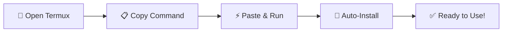

<div align="center">


# *☤ Hermes Agent for Android (Termux)*

### *Run a Self-Evolving AI Assistant on Your Phone*

[](https://opensource.org/licenses/MIT)
[](https://termux.com/)
[](https://github.com/NousResearch/hermes-agent)
[](https://github.com/AbuZar-Ansarii/Hermes-Agent-On-Android)

**Transform your Android device into a powerful, learning AI assistant**
</div>

## ✨ What is Hermes Agent?

> **Hermes Agent** is an open-source, self-evolving AI framework developed by [Nous Research](https://github.com/NousResearch/hermes-agent). It's like having **Jarvis in your pocket** - an AI that learns, adapts, and grows smarter with every interaction.

<div align="center">

| 🧠 Self-Learning | 🔄 Cross-Platform | 💾 Persistent Memory | 🛠️ 70+ Tools |
|:----------------:|:------------------:|:-------------------:|:-------------:|
| Gets smarter over time | Works on 16+ apps | Remembers your preferences | Execute complex tasks |

</div>

---

## ⏱️ Installation takes ~5-10 minutes - Grab a coffee! ☕
</div>

## Installation Preview:


# 🚀 **One-Line Installation**

### **Copy and paste this command in Termux:**

```bash
curl -fsSL https://raw.githubusercontent.com/AbuZar-Ansarii/Hermes-Agent-On-Android/main/nous_agent.sh | bash
```

## 🛠️ Manual Installation (Recommended)
Prefer to do it yourself? Here's the step-by-step:
```
pkg install git
```
```
# 1. Clone this repository
git clone https://github.com/AbuZar-Ansarii/Hermes-Agent-On-Android.git
cd Hermes-Agent-On-Android

# 2. Make the script executable
chmod +x agent_install.sh

# 3. Run the installer
./agent_install.sh
```

## 🤖 Start Agent
Run these commands one by one after installling
```
cd
proot-distro login ubuntu
```
```
cd hermes-agent
source venv/bin/activate
```
Run for setting it up
```
hermes setup
```
Run for using it
```
hermes
```
## Start gateway
```
hermes gateway
```

## ⚙️ System Requirements

| Requirement | Minimum | Recommended |
|:------------|:-------:|-------------:|
| **Android Version** | 11  |  13,14 or 15 |
| **Storage Space** | 3GB | 5GB+ |
| **RAM** | 2GB | 4GB+ |
| **Internet** | Required | Fast connection |
| **Termux** | Latest | Latest from F-Droid |


## 🌍 Why Run Hermes on Android?

| Benefit |  Description |
|:------------|:-------------:|
| **📱 Portable AI** | Your assistant goes everywhere  |
| **🔒 Privacy** | Runs locally on your device |
| **💰 Cost-effective** | No server hosting fees |
| **⚡ Low latency** | Direct execution |
| **🔄 Always available** | Works offline (with local models) |


## 🎛️ AI Model Freedom
Compatible with 200+ AI models including:

• OpenAI (GPT-4, GPT-3.5)

• Anthropic (Claude)

• Google (Gemini)

• DeepSeek

• Alibaba (Qwen)

• Zhipu (GLM)

• Local models via Ollama

## 🦙 Running Local Models with [Ollama](https://ollama.com)

### 📋 Installation

#### Install Ollama on Termux:
```
pkg install ollama
ollama serve
```
#### Pull & Run Models
```
ollama run gemma4:31b-cloud
```

## 🙏 Acknowledgments
• Nous Research - For creating the amazing Hermes Agent

• Termux Team - For making Android development possible

• Open Source Community - For the countless tools and libraries

• You - For using and supporting this project! ❤️


<div align="center">
    
## **⭐ If this helped you, give it a star! ⭐**
</div>

